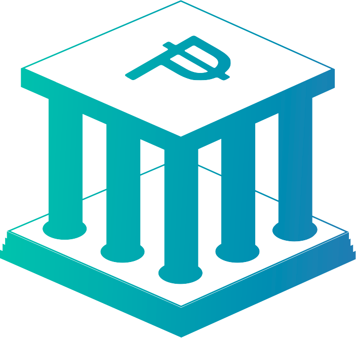

<a name="readme-top"></a>

<div align="center">

<a href="https://github.com/DSO-TECHINFO/bancodelapeseta-frontend">
  
</a>

## Banco De La Peseta

[![Contributors][contributors-shield]][contributors-url]
[![Forks][forks-shield]][forks-url]
[![Stargazers][stars-shield]][stars-url]
[![Issues][issues-shield]][issues-url]

Check out the [Spanish version](./.github/README-ES.md) of this document.

Banco De La Peseta is a digital banking platform made by and for the community.

[Report an issue](https://github.com/DSO-TECHINFO/bancodelapeseta-frontend/issues) · [Suggest something](https://github.com/DSO-TECHINFO/bancodelapeseta-frontend/issues)

</div>

<details>
<summary>Table of contents</summary>

- [Main features](#main-features)
  - [Screenshots:](#screenshots)
- [Getting started](#getting-started)
  - [Prerequisites](#prerequisites)
  - [Installation](#installation)
- [Contributing](#contributing)
- [Stack](#️stack)

</details>

## Main features

- **User-friendly Interface**: Modern, clean, and easy-to-navigate user interface.
- **Secure Online Banking**: Enhanced security features to keep user data and transactions safe.

### Screenshots


<p align="right">(<a href="#readme-top">back to top</a>)</p>

## Getting started

### Prerequisites

Before running this project, make sure you have the latest version of npm installed

  ```sh
  npm install npm@latest -g
  ```

### Installation

1. Clone the repository

   ```sh
   git clone https://github.com/DSO-TECHINFO/bancodelapeseta-frontend.git
   ```

2. Install NPM packages

   ```sh
   npm install
   ```

3. Run the project

   ```sh
   npm run start
   ```

<p align="right">(<a href="#readme-top">back to top</a>)</p>

## Contributing

We welcome contributions from everyone. Whether it's a bug fix, new feature, or improvement to our documentation, your help is appreciated!

Please check out our [contribution guidelines](https://github.com/DSO-TECHINFO/bancodelapeseta-frontend/blob/master/CONTRIBUTING.md) for more information on how to submit a good pull request.

### Contributors

[](https://github.com/DSO-TECHINFO/bancodelapeseta-frontend/graphs/contributors)

<p align="right">(<a href="#readme-top">back to top</a>)</p>

## Stack

- [![Ionic][ionic-badge]][badge-empty-url] - Crossplatform development framework.
- [![Angular][angular-badge]][badge-empty-url] - JavaScript frontend framework.
<!-- -  - Java for backend -->
- [![Typescript][typescript-badge]][badge-empty-url] - JavaScript with syntax for types.
- [![Tailwind CSS][tailwind-badge]][badge-empty-url] - A utility-first CSS framework for rapidly building custom designs.

<p align="right">(<a href="#readme-top">back to top</a>)</p>

[ionic-badge]: https://img.shields.io/badge/Ionic-3880FF?style=for-the-badge&logo=ionic&logoColor=white
[angular-badge]: https://img.shields.io/badge/Angular-DD0031?style=for-the-badge&logo=angular&logoColor=white
[java-badge]: https://github.com/carlosulisesochoa/carlosulisesochoa/raw/files/images/java.jpg
[typescript-badge]: https://img.shields.io/badge/Typescript-007ACC?style=for-the-badge&logo=typescript&logoColor=white&color=blue
[tailwind-badge]: https://img.shields.io/badge/Tailwind-ffffff?style=for-the-badge&logo=tailwindcss&logoColor=38bdf8
[contributors-shield]: https://img.shields.io/github/contributors/DSO-TECHINFO/bancodelapeseta-frontend.svg?style=for-the-badge
[contributors-url]: https://github.com/DSO-TECHINFO/bancodelapeseta-frontend/graphs/contributors
[forks-shield]: https://img.shields.io/github/forks/DSO-TECHINFO/bancodelapeseta-frontend.svg?style=for-the-badge
[forks-url]: https://github.com/DSO-TECHINFO/bancodelapeseta-frontend/network/members
[stars-shield]: https://img.shields.io/github/stars/DSO-TECHINFO/bancodelapeseta-frontend.svg?style=for-the-badge
[stars-url]: https://github.com/DSO-TECHINFO/bancodelapeseta-frontend/stargazers
[issues-shield]: https://img.shields.io/github/issues/DSO-TECHINFO/bancodelapeseta-frontend.svg?style=for-the-badge
[issues-url]: https://github.com/DSO-TECHINFO/bancodelapeseta-frontend/issues
[badge-empty-url]: #!
