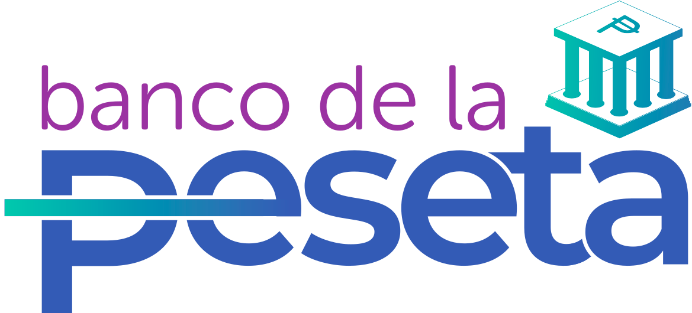

<a name="readme-top"></a>

<div align="center">

[![Contributors][contributors-shield]][contributors-url]
[![Forks][forks-shield]][forks-url]
[![Stargazers][stars-shield]][stars-url]
[![Issues][issues-shield]][issues-url]

<a href="https://github.com/DSO-TECHINFO/bancodelapeseta-frontend">
  
</a>

## Banco De La Peseta

Check out the [Spanish version](./.github/README-ES.md) of this document.

Banco De La Peseta is a project made by and for the community.\
[Report an issue](https://github.com/DSO-TECHINFO/bancodelapeseta-frontend/issues) · [Suggest something](https://github.com/DSO-TECHINFO/bancodelapeseta-frontend/issues)

</div>

<details>
<summary>Table of contents</summary>

- [Official website of Banco De La Peseta](#web-oficial-de-la-velada-iv)
- [Main features](#características-principales)
  - [Screenshots of the Banco De La Peseta website:](#capturas-de-pantalla-de-la-web-de-la-velada-iv)
- [Getting started](#para-empezar)
  - [Prerequisites](#prerequisitos)
  - [Installation](#instalación)
- [Contributing to the project](#contribuir-al-proyecto)
- [🛠️ Stack](#️-stack)

</details>

## Main features

- **Highlighted project details #1**: Pending.
- **Highlighted project details #2**: Pending.

### Screenshots of the Banco De La Peseta website


<p align="right">(<a href="#readme-top">back to top</a>)</p>

## Getting started

### Prerequisites

We suggest having the latest version of npm

  ```sh
  npm install npm@latest -g
  ```

### Installation

1. Clone the repository

   ```sh
   git clone https://github.com/DSO-TECHINFO/bancodelapeseta-frontend.git
   ```

2. Install NPM packages

   ```sh
   npm install
   ```

3. Run the project

   ```sh
   npm run start
   ```

<p align="right">(<a href="#readme-top">back to top</a>)</p>

## Contributing to the project

Contributions are what make the open-source community an amazing place to learn, inspire, and create. Any contributions you make are **greatly appreciated**!

If you have any suggestions that could improve the project, please do a [_fork_](https://github.com/DSO-TECHINFO/bancodelapeseta-frontend/fork) of the repository and create a [_pull request_](https://github.com/DSO-TECHINFO/bancodelapeseta-frontend/pulls). You can also simply open an [_issue_](https://github.com/DSO-TECHINFO/bancodelapeseta-frontend/issues) with the tag "enhancement".

Here's a quick guide:

1. Do a [_fork_](https://github.com/DSO-TECHINFO/bancodelapeseta-frontend/fork) of the Project
2. Clone your [_fork_](https://github.com/DSO-TECHINFO/bancodelapeseta-frontend/fork) (`git clone <URL of the fork>`)
3. Add the original repository as a remote (`git remote add upstream <URL of the original repository>`)
4. Create your Feature Branch (`git switch -c feature/AmazingFeature`)
5. Make your Changes (`git commit -m 'Add: some AmazingFeature'`)
6. Push to the Branch (`git push origin feature/AmazingFeature`)
7. Open a [_pull request_](https://github.com/DSO-TECHINFO/bancodelapeseta-frontend/pulls)

Please see our [contribution guide](https://github.com/DSO-TECHINFO/bancodelapeseta-frontend/blob/master/CONTRIBUTING.md) to learn how you can start in the best way following good practices.

### Contributors

[](https://github.com/DSO-TECHINFO/bancodelapeseta-frontend/graphs/contributors)

<p align="right">(<a href="#readme-top">back to top</a>)</p>

## 🛠️ Stack

- [![Typescript][typescript-badge]][badge-empty-url] - JavaScript with syntax for types.
- [![Tailwind CSS][tailwind-badge]][badge-empty-url] - A utility-first CSS framework for rapidly building custom designs.

<p align="right">(<a href="#readme-top">back to top</a>)</p>

[typescript-url]: https://www.typescriptlang.org/
[tailwind-url]: https://tailwindcss.com/
[typescript-badge]: https://img.shields.io/badge/Typescript-007ACC?style=for-the-badge&logo=typescript&logoColor=white&color=blue
[tailwind-badge]: https://img.shields.io/badge/Tailwind-ffffff?style=for-the-badge&logo=tailwindcss&logoColor=38bdf8
[contributors-shield]: https://img.shields.io/github/contributors/DSO-TECHINFO/bancodelapeseta-frontend.svg?style=for-the-badge
[contributors-url]: https://github.com/DSO-TECHINFO/bancodelapeseta-frontend/graphs/contributors
[forks-shield]: https://img.shields.io/github/forks/DSO-TECHINFO/bancodelapeseta-frontend.svg?style=for-the-badge
[forks-url]: https://github.com/DSO-TECHINFO/bancodelapeseta-frontend/network/members
[stars-shield]: https://img.shields.io/github/stars/DSO-TECHINFO/bancodelapeseta-frontend.svg?style=for-the-badge
[stars-url]: https://github.com/DSO-TECHINFO/bancodelapeseta-frontend/stargazers
[issues-shield]: https://img.shields.io/github/issues/DSO-TECHINFO/bancodelapeseta-frontend.svg?style=for-the-badge
[issues-url]: https://github.com/DSO-TECHINFO/bancodelapeseta-frontend/issues
[badge-empty-url]: #!